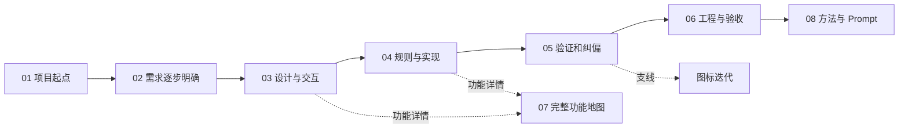

# 我如何用 AI 优化一个 Shopify App

## HTML 无限画布设计规划

版本：v6，按参考图调整 AI 动作反馈色。整理日期：2026-09-15。项目：`nuphy-extension-only-app`。

**建议把它做成一张可以按顺序讲、也可以自由探索的项目复盘画布。** 横向呈现需求怎样逐步变清楚，纵向展开每一步的用户输入、分析与决策、执行和结果。团队既能看到界面与功能变化，也能学会如何给 AI 提要求、纠正判断、验证交付。

本规划已用于制作 HTML；用户随后提供的 DESIGN.md 覆盖第 7 节的视觉方向。实现和验收记录见第 13 节。

## 1. 这次分享要讲清楚什么

读者按产品、设计、运营和开发混合团队考虑。推荐用 15–20 分钟完成主线讲解，详细功能和证据供会后查看。

分享结束后，团队成员应能回答：

- 原来的操作哪里费劲，用户怎样把模糊的不满变成明确要求？
- 哪些能力可以直接使用 Shopify 原生组件，哪些需要补业务规则？
- 一项界面要求怎样影响配置、商城、折扣和结账？
- 如何通过截图、实际操作和测试纠正 AI 的判断？
- 哪些结果已落地，哪些仍是方案、试验或待验收工作？
- 换一个项目时，如何复用这套协作方式？

叙述采用你的视角，例如“我提出了什么”“我为什么继续追问”。AI 的部分呈现**有记录支撑的分析与决策摘要**：看到什么证据、作出什么选择、选择为何改变。不会把事后归纳写成当时逐字发生的心理过程。

## 2. 资料范围与事实口径

### 2.1 已覆盖的聊天窗口

已核对 Codex 当前项目列表、归档列表和本机任务索引。按本次分享范围纳入 4 个用户聊天窗口，其中 3 个提供历史材料，另 1 个是本次规划请求。子 Agent、自动审批记录不计作独立用户聊天窗口。

| 编号 | 窗口标题 | 纳入内容 |
| --- | --- | --- |
| S1 | 分析嵌入式 App 架构与鉴权 | 架构核查、原生选择器实测、开发店切换、UX 方案、截图纠偏、产品排除、排期、代码收敛、双仓联动风险 |
| S2 | 分析分支差异并整理优化文档 | 分支取舍、原生能力复用、赠品开关、Handle 搜索、Tooltip、Save Bar 试验、TS/Vitest 整理、列表、容量、命名与图标迭代 |
| S3 | 添加当前提交更新日志 | 更新日志、变更归属核实、`configuration.ts` 是已有文件还是新增文件的澄清 |
| S4 | 当前窗口 | 团队分享目标、无限画布形式、设计规划优先与可复用 Prompt 要求 |

S4 的完整标题是：“请结合当前项目nuphy-extension-only-app所有聊天窗口，生成一个HTML 无限画布，详细讲解本次优化的所有功能，包括我的输入，以及AI的思考步骤，执行了什么，得到了什么结果。我希望用这个例子告诉团队成员我是如何用AI优化设计、优化产品功能，并落地的。最后总结一个可复用的promt文本。”此处为方便阅读合并了标题中的换行。

S2 的任务读取工具连续返回错误，已改为读取该任务本机 JSONL 中的用户消息、助手公开答复和相关工具结果。未将其他项目的聊天混入本项目；商城联动内容来自 S1 的跨仓审查。

### 2.2 每个结果都要有两个时间视角

画布中，“当时验证了什么”和“今天代码处于什么状态”分别显示。

| 范围 | 可写入画布的事实 |
| --- | --- |
| 9 月 9 日主要优化 | 有 `3300ac4`、`2470356`、`78e8f08` 等提交；历史记录包含 61style 开发店的真实界面操作和测试结果 |
| 9 月 15 日后续优化 | 工作区中存在开关、搜索适配、列表和结构调整；当前仍未提交。历史测试输出可核对到管理端 76 项、折扣 Function 55 项，共 131 项通过 |
| 当前 Git | 分支为 `codex/bogo-ux-products-scheduling`，HEAD 为 `78e8f08`；不能用历史的测试通过替代当前工作区验证 |
| 当前容量提示 | 组件引用 `MAX_CONFIG_BYTES`，当前配置模块未导出它。应标“历史已验证，当前存在集成缺口”，不能标“当前构建通过” |
| 商城、结账、生产 | 历史记录明确未完成同一开发店的商城到真实结账端到端验收；本轮没有验证生产状态 |
| 品牌命名与图标 | AI 提出过 “NuPhy Bonus · 加赠”，生成过多版图标；没有找到用户最终接受或后台应用的证据 |

测试数量只在证据详情中显示，并附日期和测试范围。不同轮次的 50、72、73、131 项不能累加成“总共通过多少项”，也不能据此计算效率提升。

## 3. 画布结构：横向演进，纵向追溯

主标题使用 **《我如何用 AI 优化一个 Shopify App》**，副标题为“NuPhy 买赠活动管理：需求、设计、实现与验证”。“NuPhy Bonus”作为命名探索内容出现，暂不作为已经定稿的产品名称。

### 3.1 八个区域

| 区域 | 内容与主要画面 | 希望读者理解的事情 |
| --- | --- | --- |
| 01 项目起点 | 项目关系小图、原始操作问题、前后界面缩略图、状态总览 | 先理解实际任务与系统边界 |
| 02 把需求说清楚 | 用户原话、参考截图、连续补充的产品规则 | 有效输入可以在迭代中形成，不必一开始就写完需求 |
| 03 设计怎样改变 | 原生选择器、回显、独立编辑页、提示与列表的前后对照 | 设计要求如何落实到具体操作 |
| 04 功能怎样跑起来 | 产品范围、排期、数量额度、单活动保存和失败恢复 | 一个看起来简单的表单背后有哪些业务约束 |
| 05 持续纠偏 | 原生搜索核验、Save Bar 撤回、图标反馈 | AI 的建议需要验证，也需要用户继续判断 |
| 06 工程与验收 | 代码整理、测试、开发店实测、商城联动风险、当前差异 | 怎样判断“完成到哪一步” |
| 07 完整功能地图 | 所有功能卡、来源、状态与细节入口 | 主线讲解之外仍能查全量信息 |
| 08 可复用方法 | 协作步骤、Prompt 正文、复制入口 | 团队成员能在自己的任务中开始使用 |

区域 01–06 横向排列；07 位于主线下方，08 放在主线终点。品牌探索作为区域 05 的支线，与主要买赠功能连接。



连线只表达三种关系：“导致下一步”“纠正了之前的判断”“查看实现或证据”。局部出现反馈回环，不在全图上铺满交叉线。

### 3.2 每个案例的固定结构

每个案例使用四条纵向对齐的内容带：

1. **我的输入**：短原话、日期、参考图；标明初始要求或后续纠正。
2. **分析与决策**：问题、核实依据、选定方案与主要限制；必要时补充被推翻的判断。
3. **执行**：工具类别、修改位置、实际操作。技术细节展开后查看。
4. **结果**：界面或行为变化、验证结果、剩余问题、证据入口。

摘要卡控制在约 100–180 字。完整讲解、更多原话和代码证据放入详情面板，缩小画布时仍能读懂主线。

用户原话与编辑后的摘要采用不同样式；事后提炼的经验写“复盘归纳”。找不到原话的背景功能，只显示代码依据。

## 4. 主线演示脚本

以下 14 站作为“开始讲解”的默认路线，讲解时间是建议时长。

| 站点 | 用户输入摘录或背景 | 执行与结果 | 团队可复用的方法 |
| --- | --- | --- | --- |
| 1 · 认识项目 | “为什么它的嵌入式 app 不需要鉴权就可以显示？” | 核查 App Home 入口、`shopify.query` 和配置存储；解释项目使用 Shopify 托管运行时 | 先问清系统如何工作，再决定怎么改 |
| 2 · 要求实测 | “我让你验证 shopify.resourcePicker 至于吗？” | 类型声明、控制台上下文与真实运行表现曾不一致；切换到可用开发店验证选择器 | 让 AI 用实际运行补足推断 |
| 3 · 提出体验问题 | “我感觉非常没有产品 ux 设计，很迷幻。能不能先出一份优化方案？” | 审查列表、编辑、错误反馈与选择流程，先形成 UX 方案 | 把“难用”拆成具体任务障碍 |
| 4 · 补业务语义 | “产品选择应该是选择产品纬度，而不是变体纬度” | 改为整款选择；补充排除指定规格、活动开始与结束时间 | 说明用户怎样做事，同时讲清例外 |
| 5 · 用图纠正理解 | “这个是我想要的”“应该是这样！” | 根据参考图修正回显；再次纠偏后把规格勾选放回原生弹窗，移除页面二次选择 | 图片负责表达结构，文字负责解释行为 |
| 6 · 补齐真正的规则 | 多赠品、数量、排期与保存 | 追踪产品范围、共享免费额度、独立自动折扣和单活动保存 | 检查界面背后的业务结果 |
| 7 · 要求代码收敛 | “功能完整性的前提下，保证代码简洁、可阅读可维护。” | 合并页面状态，统一异步入口，保留必要锁；后续整理 types、utils、components 和 Vitest | 验收功能后继续要求维护质量 |
| 8 · 复用平台能力 | “原生搜索应该有这个功能啊！” | 实测原生产品搜索支持 Handle；规格模式发现差异后，只补 Handle 到产品 ID 的适配 | 先验证已有能力，再决定新增代码 |
| 9 · 打磨运营细节 | 开关、Tooltip、表头、省略号、中文时间文案、容量提示 | 补齐选择约束与信息层级；保留错误和重要费用提醒 | 反馈要具体到控件、文案与状态 |
| 10 · 展示没有完成的尝试 | Save Bar、图标多轮否定 | Save Bar 未接通后撤回；图标持续迭代但未确认定稿 | 不用“已经生成”替代“已经满足需求” |
| 11 · 检查整条交易链 | “分析一下……联动性和入侵性……是否存在风险问题？” | Review 发现活动身份、失效赠品、库存和结账放行等问题 | 页面通过后，还要审查上下游 |
| 12 · 沉淀复用 | 更新日志与本次画布 | 对齐变更归属、结果状态和复用 Prompt | 把做法整理成别人能执行的流程 |

其中站点 4–6 为重点案例，约占 6 分钟；工程与风险约占 4 分钟。全量历史不按聊天轮次逐页播放。

## 5. 全量功能覆盖清单

“已提交”指代码状态；“历史实测”指当时的开发预览记录。两者均不代表当前生产验证。

### 5.1 产品设计与表单交互

| ID | 功能 | 画布中需要讲解的变化 | 结果与边界 |
| --- | --- | --- | --- |
| F01 | 列表与独立编辑页 | 草稿、已保存活动与编辑操作分开；按名称、产品、赠品、数量、时间组织表单 | 核心已提交，历史开发店实测 |
| F02 | 原生产品及规格选择 | 产品分组、整款勾选、取消个别规格、预选恢复、取消保持草稿 | 已提交；使用平台选择器 |
| F03 | 商品回显与移除 | 主商品按产品，赠品按具体规格显示；图片、名称、辅助信息、移除操作 | 已提交；参考图到实现的重点对照 |
| F04 | 字段校验与草稿保护 | 空名称、缺产品、缺赠品、数量和时间错误定位到字段；保存失败保留输入 | 已提交；包含应用内放弃、删除、重新加载确认 |
| F05 | 两个赠品选择开关 | 单规格限制与有库存筛选独立、默认关闭；不自动删掉已有选择 | 9/15 未提交；仅本次编辑生效。库存会再次读取，仍不等于库存预占 |
| F06 | 搜索与 Handle 适配 | 原生搜索承担常规检索；规格模式的单个 `handle:` 条件转换为产品 ID | 9/15 未提交；只描述已支持的查询形式 |
| F07 | 说明信息层级 | 7 处补充说明收进原生 info + Tooltip；键盘聚焦可读 | 历史实测；错误、费用提醒和时区保持可见 |
| F08 | 列表信息补齐 | 活动名称、主商品、赠品、规格数、状态、独立编辑按钮；长名称省略与全文提示 | 9/15 未提交；读不全时显示“规格待确认”，历史含窄屏验证 |
| F09 | 中文文案和配置容量 | “开始时间 / 结束时间”；已保存配置的 UTF-8 字节数与保存范围说明 | 当前容量常量存在集成缺口；草稿不计入已保存用量 |
| F10 | FREE GIFT 标签开关 | 区分标签显示与赠品、折扣规则 | 代码存在；商城显示由关联仓库消费 |
| F11 | 原生 Save Bar 探索 | 用户给出宿主顶栏参考，核对并试接原生表单 | 历史未接通，试验已撤回；保留应用内保存，不宣称完整宿主离开保护 |

### 5.2 促销规则与保存可靠性

| ID | 功能 | 画布中需要讲解的变化 | 结果与边界 |
| --- | --- | --- | --- |
| F12 | 整款参与、规格排除 | 新活动存产品范围及排除项，新增规格默认参与；旧活动保留规格白名单 | 已提交；不能无意扩大旧活动范围 |
| F13 | 完整读取与异常处理 | 分页读全产品规格；缺失商品、异常分页和不可读数据明确提示 | 已提交；避免用不完整结果覆盖选择 |
| F14 | 加入数量与免费额度 | 跟随主商品数量或固定加入数量；多个赠品共享免费额度 | 已实现；多选赠品不代表每个赠品都免费，也不是顾客任选一个 |
| F15 | 活动排期和状态 | 立即或指定开始、可选结束、店铺时区、未开始/进行中/已结束/已停用 | 已提交，历史验证原生折扣“已安排”和停用状态 |
| F16 | 原生自动折扣绑定 | 启用活动对应独立折扣，绑定到活动，由 Shopify 执行排期 | 已提交；需要核对旧折扣组合设置与迁移条件 |
| F17 | 单活动保存与并发冲突 | 保存 A 不覆盖 B；同一活动发生并发修改时拒绝旧草稿覆盖 | 已提交，历史有双页面操作证据 |
| F18 | 失败恢复与旧折扣停用 | 准备折扣、发布配置、停用旧折扣；响应丢失后读回确认 | 已有实现；9/15 补保存锁等待旧折扣处理的修复。异常遗留和平台容量仍需如实说明 |
| F19 | 旧活动配置迁移 | 识别店铺旧配置，确认导入并切换 managed；保留旧范围语义 | 已实现；用于当前店铺的旧活动配置迁移 |
| F20 | Function 优惠校验 | 核对活动、赠品规格、真实主商品与剩余免费额度 | 已有实现及测试；通过图解说明不能只信购物车属性 |

### 5.3 工程、上下游与探索

| ID | 内容 | 画布中需要讲解的变化 | 结果与边界 |
| --- | --- | --- | --- |
| F21 | 状态与副作用收敛 | 历史 AppHome 的 12 组 state 收敛为 2 组，统一异步入口，按排期边界更新时间 | `78e8f08` 已提交；保留必要锁和 ref，避免只追求计数减少 |
| F22 | 目录与测试整理 | TS/TSX、Vitest、`__test__`、types、utils、components、烤串命名、简短中文注释 | 9/15 未提交；讲清可读性收益，测试数量不当作业务收益 |
| F23 | 分支取舍与日志 | 逐功能比较分叉分支，识别原生能力已覆盖的改动，记录提交与未提交范围 | 已有分析与更新日志；同为配置 version 1 的新旧消费者存在兼容风险 |
| F24 | 商城联动审查 | 活动配置 → 加赠与行属性 → 折扣 → 结账入口，逐段检查行为 | 历史已发现风险；未找到完整闭环证据，不能写成全部修复 |
| F25 | 命名与图标设计 | 名称建议、礼盒到图形/奖章、补文字、指定底色和白字、背景透明问题修正 | 有多轮生成与反馈记录；未确认最终接受，当前项目 assets 缺失 |
| F26 | 原有结账校验和环境脚本 | 交代盲盒数量、搭配约束及开发/生产构建选择 | 作为系统背景展示；盲盒校验是此前功能，不计成本轮新增 |

## 6. 三个重点案例怎样展开

### 案例一：整款参与，少数规格除外

上方并排展示用户参考图和原生弹窗实测图；下方放一条可操作的规则示意。

**我的输入**

> “一个产品往往有十几个变体。”
>
> “我选择了这两个产品所有属性，然后需要排除 a或者b的某一个属性。”

**分析与决策摘要**

运营希望先选产品，再处理例外。新活动因此使用“产品范围 + 排除项”；旧活动仍按原规格白名单执行。选择器负责勾选，页面负责清楚回显。

**执行**

修改原生选择器参数与预选恢复；调整配置表达、商品完整读取、商城匹配和折扣匹配；核对取消、重开、保存刷新等路径。

**结果与演示**

用虚构的“产品 A / 产品 B”示意：勾选 A、B，取消 A 的一个规格；结果显示 A 的排除项和 B 的完整范围。点击“后来新增规格”，解释新活动纳入新规格、旧白名单不自动扩大。该互动标明“规则示意”，不会连接真实店铺。

旁边展示真实证据：开发店的预选、排除、回填与取消验证；同店商城到结账的验收边界另列。

### 案例二：少写一个选择器，仍要补准确的业务适配

用一条有回环的过程线呈现：

“main 有 Handle 搜索” → “用户追问原生是否已有” → “产品模式实测支持” → “新增开关切换到规格模式” → “相同查询出现差异” → “仅补 Handle 到产品 ID 的转换”。

重点说明两个结论可以同时成立：已有的产品搜索值得复用，规格模式仍需要局部适配。记录 AI 如何根据新证据调整实现范围。

右侧用两个开关示意选择行为；下方解释“只能选一个规格”与“免费几件”是不同概念。用“买 1 件主商品、选 2 个赠品规格”的例子展示当前共享免费额度，避免把多选当作全部免费。

### 案例三：设计反馈不等于已经定稿

品牌支线按可找回的实际图像展示版本，旁边保留用户的具体反馈：

- “没有设计感，没有色彩搭配感，不够现代化。”
- “可以以图片为参考去设计吗。”
- “咋没有文字？”
- “我要这个颜色的背景……文字要用白色。”

每次记录“修改了什么”和“用户是否接受”。透明背景修正属于文件问题修复，不能用它证明用户已经接受视觉设计。结尾标记“待确认定稿”。

这个案例的复盘归纳是：抽象评价需要继续转成图形、配色、文字和参考关系；文件规格正确与视觉满意分别验收。

## 7. 视觉方向与页面骨架

视觉以用户提供的 `/Users/liaoyi/Downloads/DESIGN.md` 为准，采用 Apple 风格的浅灰画布、白色章节和深色大标题。用留白与字号分层，真实截图保留原貌。

| 元素 | 实现规则 |
| --- | --- |
| 背景与章节 | `#F5F5F7` / `#FFFFFF`，无点阵、无阴影 |
| 正文与边线 | 正文 `#1D1D1F`，边线 `#D2D2D7` |
| 操作 | 主按钮 `#0071E3`，链接 `#0066CC`；按钮胶囊圆角 |
| 证据与状态 | 中性文字和明确标签，图片标明日期与环境 |
| 字体与字号 | 系统中文无衬线；首屏标题 56 px，章节标题 40 px，正文 17 px |
| 章节 | 宽 1100 px，圆角 8 px；固定顶栏和章节导航 |

```text
┌ 项目标题 ── 搜索 ── 状态筛选 ── 开始讲解 ── 阅读模式 ── 全屏 ┐
│ 章节目录                                                   │
│ 01 起点     02 需求       03 设计       04 实现       …     │
│            ┌ 我的输入 ┐ ┌ 我的输入 ┐                       │
│            ├ 分析决策 ┤ ├ 分析决策 ┤     点击打开详情 →     │
│            ├ 执行动作 ┤ ├ 执行动作 ┤                       │
│            └ 结果证据 ┘ └ 结果证据 ┘                       │
│                                                           │
│      07 完整功能地图                         08 Prompt      │
│ 帮助 / 当前章节                缩放 · 适应全图       小地图 │
└───────────────────────────────────────────────────────────┘
```

首次打开聚焦区域 01，能读到标题、项目背景和“开始讲解”。全图缩略只作为导航，不作为默认阅读尺度。

## 8. 无限画布的交互规划

| 交互 | 具体行为 |
| --- | --- |
| 平移 | 拖动空白处；按住空格临时拖动画布；文本区域仍可选择和复制 |
| 缩放 | 加减按钮、Ctrl/Cmd + 滚轮围绕指针缩放；范围 8%–160% |
| 触控板 | 双指滚动平移；捏合缩放，避免滚动详情面板时带动画布 |
| 快速定位 | 目录和小地图定位章节；搜索和功能链接打开固定字号详情 |
| 讲解模式 | 按 14 站路线切换，显示当前站数；上一站、下一站、退出均可操作，无自动播放 |
| 展开详情 | 点击卡片打开固定字号的居中详情窗口，保留当前画布位置；Esc 关闭并恢复焦点 |
| 证据查看 | 截图可放大；源消息、文件、提交和测试输出按来源类型展示，明确历史时间 |
| 前后对照 | 截图并排查看；只有同范围、可比较的截图才使用拖动对照 |
| 状态筛选 | 功能表按已提交、未提交、试验撤回、待核对、设计探索、已有背景筛选，隐藏不匹配行 |
| Prompt 复制 | 单独展示可编辑变量和完整文本；复制失败时允许直接选中文字复制 |
| 分享定位 | 节点使用稳定 ID，URL hash 定位；接收者打开相同 HTML 可跳到对应章节 |
| 小屏与打印 | 小屏默认章节阅读模式；打印时转成线性正文，证据与 Prompt 保留 |

缩放低于 20% 时强调章节概览；进入章节后恢复正文。长文始终在详情面板阅读，不要求读者把微小文字放到极大比例。

键盘可以访问目录、搜索、卡片和控制按钮。快捷键在输入框中停用；减少动态效果偏好开启时，直接定位而不播放移动动画。

## 9. 素材、来源与缺口处理

每张证据卡记录：所属案例、来源窗口、消息或文件位置、时间、环境、支持的结论。主线显示短摘录，完整公开记录按需展开。

| 素材 | 当前情况 | HTML 阶段处理 |
| --- | --- | --- |
| 9/9 原始方案、验收说明和截图 | 当前工作区已删除，Git `78e8f08` 中可读取 | 从明确的历史提交提取到画布素材，标注为历史证据 |
| 9/15 开发预览与测试结果 | 公开聊天和工具结果可读取 | 提取与案例直接相关的记录；截图逐张确认可恢复性与内容 |
| 9/15 comparison 文档 | 历史聊天有生成记录，当前路径不存在 | 使用可核对的聊天与代码资料重新整理，不提供失效文档链接 |
| 图标和用户参考图 | 项目 assets 当前不存在，聊天有版本和图片记录 | 优先找回已有原图；缺图显示资料缺失，不生成替代图冒充历史 |
| 当前代码和更新日志 | 可读取；容量提示与模块导出存在不一致 | 同时保留历史结果与当前发现，注明核查日期 |

最终 HTML 内置适合团队分享的摘录和图像。私人聊天全文、访问令牌、折扣绑定值和无关账户信息不进入交付物。真实截图只做必要裁切、标注和信息遮盖；抽象规则演示明确标“示意”。

主线不放脱离上下文的“提升 X%”“节省 X 小时”。当前材料可以证明具体操作减少或某条路径通过验证，不能证明未经测量的商业收益。

### 联动风险的呈现

区域 06 放一张“开发预览之后还要查什么”的关系图，配六个历史审查发现：

- 不同活动送同一规格时，合并赠品行可能丢失活动身份，部分赠品收费。
- 活动在进入结账后失效，旧赠品存在转为原价的路径。
- 赠品部分库存不足时，数量同步可能反复阻塞结账。
- 加赠失败与售罄未正确区分，可能漏赠后仍放行。
- 配置保存失败可能遗留准备折扣，折扣容量也影响替换操作。
- 配置模式异常或新旧消费者混用时，多个执行端可能行为不一致。

它们统一标为“历史审查发现，修复状态需逐项核对”。不能用这份设计规划把风险改标为已解决，也不把开发店 UI 通过画成真实交易验收完成。

## 10. 实现方式与验收

建议交付一个可双击打开、离线阅读的 `ai-collaboration-canvas.html`。采用原生 HTML、CSS、JavaScript，使用 DOM 卡片和 SVG 连线实现平移、缩放与导航；内容和图片随 HTML 打包。

这是一份内容固定的案例讲解工具，首版提供阅读、演示和检索即可。多人协作编辑、登录、云端保存不在当前用途内。图片只保留有讲解价值的版本，详情按需显示，避免一次展开全部长文。

### 制作顺序

1. 依据本规划整理完整内容和证据索引，给每项功能分配稳定 ID。
2. 制作一个重点案例区，验证字号、截图比例、详情面板和缩放行为。
3. 扩展到八个区域，补完整功能地图、讲解路线、状态筛选与 Prompt。
4. 检查所有来源、历史状态和图片，完成桌面、小屏、键盘及离线验收。

### 完成标准

- S1–S3 三个历史窗口均有对应内容；F01–F26 每项至少能打开一张完整说明卡。
- 每个核心案例都能回答“我输入了什么、如何分析、执行了什么、得到什么结果”。
- 用户原话、公开答复与复盘归纳明确区分，所有完成状态有依据。
- Save Bar、图标和当前容量缺口的状态与事实一致。
- 首屏可读，能够按路线讲完；自由探索后可一键回到当前章节或全图。
- 拖动、缩放、搜索、证据放大和文本复制互不干扰。
- 键盘操作、详情焦点恢复、减少动态效果和小屏阅读正常。
- 离线打开无需登录；无外部资源缺失、失效素材或控制台运行错误。
- 规则演示有至少一项能发现错误的可运行检查；交互完成后做实际浏览器验证。

## 11. 可复用 Prompt

以下 Prompt 用于新的产品优化任务，覆盖需求澄清、设计、实现、验证与复盘。方括号内容由使用者替换；已有上下文时不必重复粘贴。

```text
请和我一起优化 [项目 / 产品名称]，帮助 [目标用户] 更顺畅地完成 [具体任务]，并把方案落地为可验证的结果。

背景与材料：
- 当前项目、页面或入口：[仓库路径 / URL / 操作路径]
- 我看到的问题：[描述一次真实操作、哪里费劲、出现什么错误]
- 期望行为：[用户应该怎样完成任务，结果应该是什么]
- 参考：[截图、链接、同类产品；说明参考的是结构、交互还是视觉]
- 业务规则与例外：[数量、权限、库存、时间、历史数据等]
- 约束：[平台、现有组件、技术栈、改动范围、环境与发布权限]

请按下面的方式协作：

1. 先了解现状。
阅读相关代码和上下游，实际查看可用页面。把已确认事实、需要验证的判断和缺失信息分开。优先检查项目现有实现与平台原生能力；不确定的平台能力用官方资料和真实运行核实。

2. 先交设计方案供我审阅。
说明当前问题、推荐流程、页面结构和重要取舍。覆盖空状态、加载、错误、取消、未保存、权限和数据变化等与本任务有关的状态。把我给出的参考拆成具体要求，不自行省略我明确要求的元素。

3. 根据反馈收敛方案。
保留我的业务意图，核实我的技术前提。如果我的判断或你的建议有误，给出证据并修正。非关键细节自行决定；只有影响目标、授权或明显返工的信息缺失时再问，并继续处理不依赖答案的工作。

4. 在我确认方案后完成实现。
只修改任务需要的部分，复用现有组件、工具函数和平台能力。保护未提交改动；先读调用关系再改共享逻辑。让代码职责清楚，保留必要的校验、错误处理、并发保护和无障碍支持。

5. 按实际风险验证。
使用已有检查和能发现问题的测试。界面修改要在真实运行环境操作；涉及配置、金额、库存或时间时，追到真正生效的执行端。不要用静态检查代替界面验收，也不要用开发预览代替生产验证。

6. 如实交付和复盘。
说明改了什么、怎样验证、结果是什么、哪些还未完成。明确区分方案、已修改、已测试、已提交、已部署和已验证生产。试验失败或撤回也记录原因；没有测量依据，不编造效率或业务提升数据。

过程中请保留简明记录：
我的输入 → 分析依据与决策摘要 → 执行动作 → 实际产物 → 验证结果 → 后续调整。

执行记录写已经发生的动作：读了什么、调用了什么工具、改了哪处、运行了什么检查、观察到什么结果。附文件、提交、截图或输出位置。已有功能、只做核查、尝试后撤回与本轮新增分别说清，不能把我的要求换个说法充当执行记录。

最后整理一份团队可读的变更说明和可复用经验；保留关键原话、参考、实现证据与剩余限制。先给我第一版设计规划。
```

## 12. 已采用的方向

画布采用以下结构：

1. 用“需求如何逐步变清楚”串起主线，完整功能放在可展开的地图中。
2. 视觉按用户提供的 Apple 风格执行，以用户原话、真实截图和规则图解为主体。
3. 将实测纠偏、未完成试验和当前差异一并展示，让团队能学会判断交付状态。

## 附录：本次核查的来源定位

### 聊天原始记录

- S1：`01a0840e-3d76-7d30-8cc4-b4deb2196cf2`，本机记录 `/Users/liaoyi/.codex/sessions/2026/09/09/rollout-2026-09-09T10-45-20-01a0840e-3d76-7d30-8cc4-b4deb2196cf2.jsonl`。
- S2：`01a0a2fd-100a-7c03-9468-9d97e54625b5`，本机记录 `/Users/liaoyi/.codex/sessions/2026/09/15/rollout-2026-09-15T10-54-48-01a0a2fd-100a-7c03-9468-9d97e54625b5.jsonl`。第 2591、2617 行分别保留 76 项和 55 项通过的工具结果；第 1633 行是 Save Bar 未完成及撤回的公开结论；第 2826–3123 行涵盖命名与图标反馈。
- S3：`01a0a362-b8cb-7bf3-9f30-fbf217c4deb7`，本次通过 Codex 任务读取工具核对更新日志和文件归属说明。

### 代码与历史文档

- [页面入口](/Users/liaoyi/Desktop/Nuphy/app/nuphy-extension-only-app/extensions/bogo-campaign-manager/src/app-home.tsx:17)
- [选择、保存与折扣操作](/Users/liaoyi/Desktop/Nuphy/app/nuphy-extension-only-app/extensions/bogo-campaign-manager/src/api.ts:98)
- [原生选择器和赠品开关](/Users/liaoyi/Desktop/Nuphy/app/nuphy-extension-only-app/extensions/bogo-campaign-manager/src/components/product-selection.tsx:15)
- [当前容量组件](/Users/liaoyi/Desktop/Nuphy/app/nuphy-extension-only-app/extensions/bogo-campaign-manager/src/components/configuration-status.tsx:1)与[配置解析模块](/Users/liaoyi/Desktop/Nuphy/app/nuphy-extension-only-app/extensions/nuphy-free-gift-discount/src/configuration.ts:51)
- [已保存的更新日志](/Users/liaoyi/Desktop/Nuphy/app/nuphy-extension-only-app/CHANGELOG.md:3)
- 历史 UX 方案、验收文档及截图：Git `78e8f08:docs/ux/2026-09-09/`。当前工作区中这些文件已删除，本次从 Git 只读核对。

本文是设计规划，依据聊天、代码和历史验证记录整理。本轮没有重新执行项目测试或复验店铺，因此当前运行状态以文中的明确边界为准。


## 13. HTML 实现记录

已生成 `ai-collaboration-canvas.html`，包含 8 个章节、14 站讲解、26 项功能与相关工作、42 条原始输入，以及 17 张内嵌历史图片。两个交互示意分别解释整款参与与规格排除、赠品加入数量与免费额度。

HTML 内嵌样式、脚本、素材和内容，下载单个文件即可离线打开。桌面支持平移缩放和章节定位；小屏默认阅读模式。搜索、详情、图片放大、来源索引和 Prompt 复制均在页面内完成。

本文件记录的是复盘画布交付，业务代码和店铺运行状态沿用有日期的证据口径。


### 画布验收

在 Codex 浏览器中检查了 1440 × 900 桌面与 390 × 844 手机尺寸。14 站讲解顺序和完成出口、平移缩放、全图、搜索空结果、状态筛选、功能详情、原话筛选、图片放大、两个规则示意及 Prompt 复制均已操作验证。手机默认阅读，未发现横向溢出；检查时控制台无错误或警告。

视觉检查覆盖背景与留白、标题层级、按钮样式、真实截图及手机排版。采用原始截图替代设计概念中的示意界面，图片均可放大。

可重复运行 `node scripts/verify-ai-canvas.mjs` 检查脚本语法、功能和来源关联、内嵌图片、详情入口与范围规则。检查通过。本轮没有重新执行促销业务测试，也没有重新验收生产店铺。


## 14. 补充 AI 实际做过的工作

主线改为左右对应的 12 组协作记录：左侧保留我的输入，右侧直接展示 AI 做过的检查、代码改动和实际操作，下方列出产物与验证结果。覆盖架构核查、UX 页面、范围与兼容、原生交互、排期和额度、保存恢复、搜索适配、表单细节、代码整理、Save Bar 试验、图标迭代、双仓审查与日志。

26 项详情补充逐步执行记录、实际产物和来源定位。讲解增加独立的保存恢复、图标迭代站点，共 14 站。主线中的 AI 行动默认可见，具体证据可从关联功能打开；保留历史验证范围，不把既有功能算作新增。


本轮补充内容已在浏览器验证：14 站可以完整走完，AI 执行步骤可被搜索，F12 的配置、商城和 Function 改动及证据可从主线打开。1440 × 900 使用左右对照，390 × 844 自动上下排列且无横向溢出；控制台检查无错误。原有检查脚本已补充 12 组主线记录、26 项执行字段和覆盖关系校验。


## 15. 动作高亮与间距修正

按用户提供的反馈色参考图，AI 动作采用浅黄色背景（rgb(255, 251, 230)）、1 px 浅黄色边框（rgb(255, 229, 143)），不显示信息图标。标题与正文使用深灰蓝色，保留加粗层级。动作区标题统一为 18 px；每步先展示加粗的具体动作标题，再展示完整说明。12 组主线和 26 项详情共增加 114 条动作标题，原步骤与证据保留。产物和结果放在动作区外，便于区分。

修复章节分割线紧贴按钮的问题：上一组按钮与下一节边线在桌面保留 32 px、手机保留 28 px。浏览器已核对实际距离；390 × 844 阅读模式无横向溢出，详情高亮与动作字段检查通过。

画布模式另将容器设为 `overflow: clip`，阻止浏览器锚点和焦点引发原生滚动；阅读模式仍使用 `overflow: auto`。已核对从画布打开功能详情时容器滚动量为 0，定位保持稳定。
