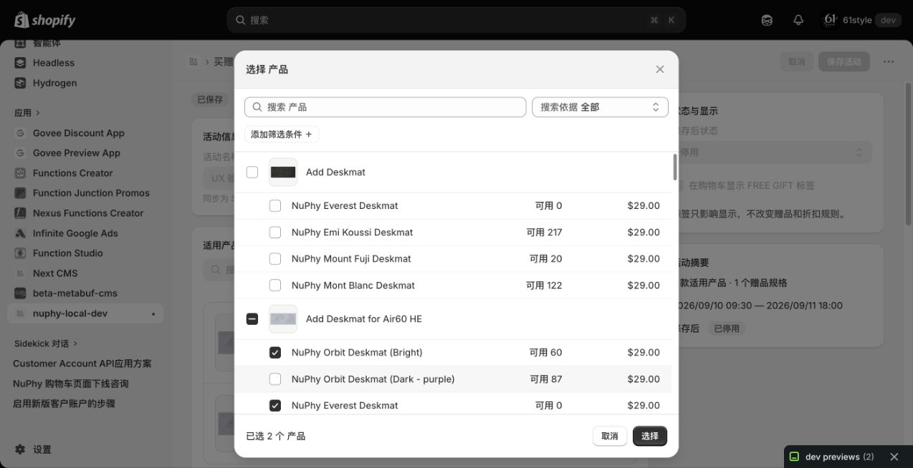
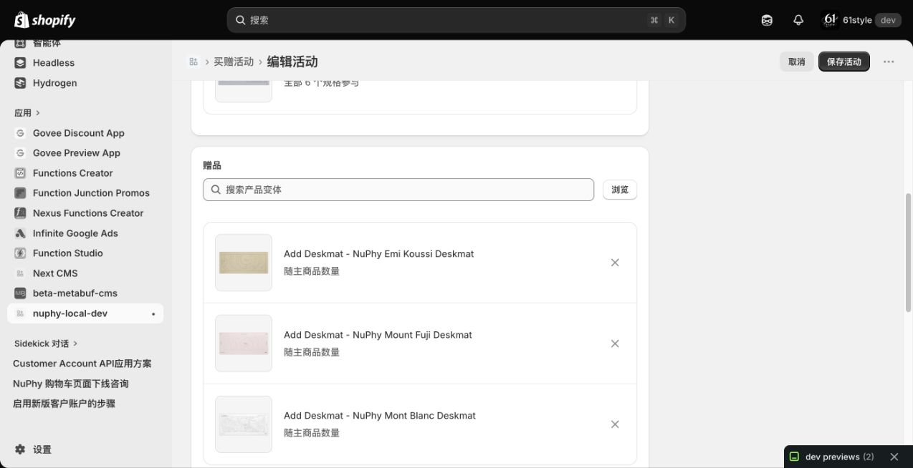
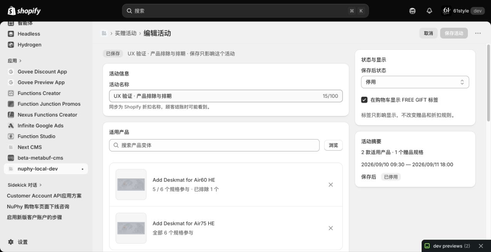
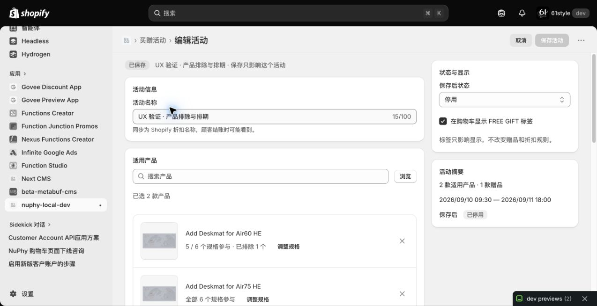
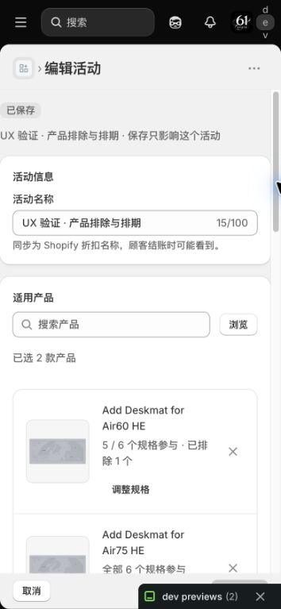

# 买赠活动实施验收

2026-09-09。App 与商城仓库均使用 `codex/bogo-ux-products-scheduling` 分支。当前代码已构建，并在 OooYi → 61style 的 `nuphy-local-dev` 开发预览中验证；未推送或部署生产。

活动列表只显示已保存的记录，单个活动独立编辑、校验和保存。产品选择器按产品分组展示规格，勾选产品可全选，再取消个别规格；适用产品保存为整款范围加排除项，未来新增规格默认参与。赠品在同一弹窗中勾选具体规格，确认后逐规格回显。旧活动的部分规格范围保留原语义。

启用的活动绑定独立 Shopify 自动折扣，由原生排期控制开始和结束。保存先准备带活动标记的折扣，再通过并发校验发布活动配置，最后停用旧折扣。商城同步读取配置，按产品、排除项和时间决定是否加赠。赠品加入数量与免费额度沿用原规则，页面明确说明多个赠品共享免费额度。

## 按最新参考图修正

搜索栏使用“搜索产品变体 + 浏览”。原生选择器改为 `type: 'product'`、`filter.variants: true`，预选携带每款产品已选的规格。页面删除自建规格展开区和赠品规格下拉框；适用产品按产品回显，赠品按所选规格回显缩略图、名称、数量和移除按钮。

本轮已在 61style 的真实托管页面验收：Air60 的原排除项正确预选，Air75 整款全选；母项全选后可取消子项，确认后重开仍保持。赠品多选后按规格逐行回显，重开预选正确；弹窗中修改后取消，原草稿不变。





## 状态与副作用整理

AppHome 从 12 个 `useState` 调用收敛为页面状态和时钟两项。配置由读取结果派生；数据、编辑草稿、当前操作和反馈在同一状态中更新。所有异步入口共用 `run`，统一处理加载状态、异常和同步锁。产品选择组件只保留搜索词状态，不再维护自己的加载锁和错误副本。

保留两个 effect：首次读取数据，以及在最近的活动开始或结束时刷新状态。删除每秒刷新整页的 interval 和驱动确认弹窗的 effect。两个 ref 分别用于阻止重复异步操作、直接打开页头的放弃确认。实测页头 slot 不转发开窗 command，因此这里保留必要的原生方法调用；正文确认框使用原生命令。

保存校验移为组件外的纯函数，产品参与范围的文案使用清晰分支。加载完整成功后才替换页面数据，避免部分读取失败时覆盖草稿。折扣准备缓存复用前重新核对存在、绑定和排期；发布确认后清理该活动缓存，断网时保留未确认的重试信息。

| 本轮重构后实测 | 结果 |
| --- | --- |
| 空表单、数量 0、结束时刻 25:00 | 阻止保存，显示字段错误并保留输入 |
| 页头取消、面包屑返回 | 打开放弃确认；取消保留草稿，确认恢复已保存活动 |
| 删除确认后取消 | 活动保留 |
| 新增第二个赠品、保存、刷新 | 两行赠品、原产品排除项和排期保留 |
| 第二个页面先保存，再保存旧草稿 | 提示并发冲突，旧草稿名称和赠品仍在 |
| 冲突后重新加载 | 取消继续保留草稿；确认后读取另一个页面的最新配置 |

测试后恢复原活动名称、一个 Emi Koussi 赠品、FREE GIFT 标签和原排期，活动保持停用。最终刷新后已核对；没有 AppHome 或 ResourcePicker 运行错误，控制台仍有 Shopify 主页面 metrics 请求错误。



## 上一版开发商店实测

测试活动为「UX 验证 · 产品排除与排期」，测试后已停用并保留，便于查看界面；对应 Shopify 自动折扣也已停止，后台显示“已过期”。

| 操作 | 结果 |
| --- | --- |
| 空表单保存 | 名称、适用产品、赠品分别显示错误，保留输入 |
| 原生产品选择器选择两款产品 | 回显两行，每款默认全部 6 个规格参与 |
| 第一款取消一个规格 | 显示“5 / 6 个规格参与 · 已排除 1 个”，第二款不受影响 |
| 选择 Add Deskmat 作为赠品 | 要求确定实际规格；选择 Emi Koussi 后显示规格名称 |
| 设置活动时间并启用 | 按 America/New_York 保存 9 月 10 日 09:30 至 9 月 11 日 18:00，活动列表显示“未开始” |
| 查看 Shopify 折扣后台 | 存在对应自动产品折扣，状态“已安排” |
| 刷新、重新编辑、重新打开选择器 | 产品预选、排除项、赠品规格和排期保留 |
| 移除一个产品后取消编辑 | 出现放弃确认，放弃后恢复已保存的两款产品 |
| 输入搜索词后点击浏览 | 原生选择器带入搜索词；取消保留原配置 |
| 保存停用状态 | App 显示“已停用”，对应 Shopify 折扣显示“已过期” |
| 桌面及窄屏 | 实测内容宽度 1273、636、354 px；产品文字换行、移除按钮可见，无文档横向溢出 |





## 自动检查

App 的 50 项测试、TypeScript 检查和完整 Shopify 构建通过。未改动的折扣 Function 上一轮 55 项测试通过。覆盖完整商品分页、规格预选与回填、排期时区和夏令时、历史时间精度、并发保存、写入响应丢失、准备折扣失效重试、缓存清理、活动绑定、产品排除和免费额度。GraphQL 沿用上一轮已通过官方 schema 校验的查询。

```sh
pnpm --filter bogo-campaign-manager check:types
pnpm --filter nuphy-free-gift-discount exec vitest run --root ../bogo-campaign-manager --globals
pnpm --filter nuphy-free-gift-discount exec vitest run
pnpm build
```

商城的 5 个测试文件、11 项测试，以及类型与 lint 检查通过。额外以真实源码验证：同款产品中，排除规格购买 10 件、参与规格购买 2 件，商城只加 2 件赠品，Function 免费额度为 2；普通商品数量保持原值。仅购买排除规格时不产生促销操作。

## 尚未覆盖与平台限制

- **商城与真实结账尚未在 61style 完成端到端联调。** 商城现有环境指向 NuPhy 店铺，本轮没有改动环境或部署商城；线上效果不能由开发预览的保存成功推定。
- **搜索使用“浏览”按钮。** 当前托管运行时的 `s-form` 没有兑现官方文档中的 Enter 提交行为，实测输入框回车不打开选择器；已移除这条失效依赖。[Form 文档](https://shopify.dev/docs/api/app-home-ui-extension/latest/web-components/forms/form)
- 应用内“取消 / 返回”的未保存确认已验证。托管 API 没有已确认的宿主离开拦截接口，刷新 Admin 或跳转到其他应用前仍需先保存；不宣称完整离开保护已接入。
- 生产迁移时需核实旧总折扣的组合设置。如果旧总折扣不能组合产品折扣，分批迁移的活动可能互斥；本轮没有修改身份未经确认的旧折扣。
- 网络中断可能留下未被活动配置引用的准备折扣。这些折扣不发放优惠，但会占用平台折扣额度；保存失败会保留输入并显示错误。
