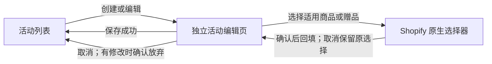

# BOGO 活动管理 UX 优化方案

2026-09-09 · 产品回显视觉已确认，其余方案待确认 · 本次未修改 App 代码

**建议把当前页面改成“活动列表 → 独立编辑页”，以一个活动为编辑和保存单位。适用商品按整个产品选择，允许排除指定规格，并增加活动开始、结束时间。** 页面围绕运营人员的判断顺序组织：哪些产品参与、哪些规格除外、送什么、送多少、何时开始和结束。

当前最影响使用的，是编辑范围、保存范围和活动状态混在一起。仅调整间距、颜色和按钮样式，解决不了这些问题。

## 1. 当前流程哪里让人困惑

本次在 61style 开发商店的 `nuphy-local-dev` 中，实际走了新建、打开原生选择器、选择两个变体、回填、缺少赠品时保存、放弃修改。检查产生的临时活动已撤销，列表恢复为 0；没有成功写入活动配置，也没有验证商城促销生效。

| 步骤 | 体验判断 | 实际观察与影响 |
| --- | --- | --- |
| 1. 进入活动列表 | 可用，层级松散 | 标题、活动管理说明、操作按钮、状态计数、空列表分散在不同区域。用户先读操作说明，才能理解怎么开始。 |
| 2. 新建活动 | 需要重构 | 未完成活动立即进入列表并显示“停用”，编辑表单接在列表下方。“活动记录”和“正在填写的内容”没有清楚边界。 |
| 3. 选择商品 | 功能可用，辨认困难 | 原生选择器已能多选；当前展示的是规格平铺，出现大量 `100 / Ink Gray / …`，缺少容易辨认的商品上下文。 |
| 4. 返回表单 | 需要整理 | 已选结果反复显示完整商品名，缺少商品分组和就地移除。开关、数量和说明排在商品选择前面，判断顺序倒置。 |
| 5. 保存失败 | 优先修复 | 实测缺少赠品时，只在顶部提示“请检查活动名称、主商品、赠品和赠送数量”；表单当前位置看不到错误，旁边却提供“重新加载（放弃未保存修改）”。 |

原生选择器、Polaris 组件和现有保存时的并发校验值得保留。此次调整重点是工作流程和反馈方式。

## 2. 页面结构

### 活动列表：用于查找和进入活动

页面标题改为“买赠活动”，主按钮统一为“创建活动”。列表只展示已保存的活动，点击活动名称进入编辑。

| 活动名称 | 适用产品 | 赠品 | 活动时间 | 状态 |
| --- | --- | --- | --- | --- |
| 示例：Node 键盘活动 | Node 系列 · 全部规格 | 配件 A · 指定规格 | 9/15 10:00–9/30 23:00 | 未开始 |

上表仅说明信息结构，不代表店铺已有此活动。产品名过长时保留可辨认的名称，多产品活动显示产品数量；有排除项时同时显示“排除 N 个规格”，完整内容在编辑页查看。时间按店铺时区展示，表头附近标明时区。

空状态只留一句“创建买赠活动，为指定商品配置赠品”和一个创建入口。移除日常页面中的操作教程、全局保存按钮和字节计数。容量接近项目限制时再给出可处理的提示。活动规模尚未体现出需求，第一版不增加搜索、批量操作和统计卡片。

### 编辑页：一次只处理一个活动

页面顶部显示“返回活动列表”、活动名称，以及“取消 / 保存活动”。保存后返回列表，并提示“活动配置已保存”。有修改时显示“有未保存的修改”；取消或返回时提供“继续编辑 / 放弃修改”。

桌面以主表单为主、简短摘要为辅；空间不足时改为单列，摘要放在表单之后。表单按以下顺序组织：

| 区域 | 内容 | 交互要求 |
| --- | --- | --- |
| 活动名称 | 内部识别名称 | 简短辅助说明，移除“1. 给活动起个名字”式教学标题。 |
| 适用产品 | 哪些产品参与、哪些规格除外 | 整款产品选择，默认所有规格参与；每款产品提供“调整规格”，取消勾选即可排除。 |
| 赠品 | 送哪些产品、实际送什么规格 | 先选择产品，多规格产品再指定实际赠送规格，避免把所有规格同时加入购物车。 |
| 数量规则 | 赠品加入数量及免费额度 | 先解决下文的规则差异，再确定最终文案和可选项。 |
| 活动时间 | 开始、结束日期与时间 | 立即开始或指定时间；可设置结束时间，明确显示店铺时区。 |
| 保存后状态 | 停用 / 启用 | 新建默认停用；启用后按排期运行，旁边展示“保存后：未开始 / 进行中 / 已结束”。 |
| 显示设置 | FREE GIFT 标签 | 放入次要区域；说明其只影响标签显示。 |

摘要只展示可核对的信息：适用产品及排除规格数、赠品及实际规格、数量规则、开始与结束时间、保存后状态。尚未填写的内容显示“待设置”，避免给出看似完整的活动预览。

## 3. 产品维度选择：整款参与，按需排除规格

适用产品的选择单位为 Product。一款产品即使有十几个规格，也只需勾选一次，默认全部参与；需要例外时，只取消少数不参与的规格。后续新增规格默认参与，无需重新配置活动。

保留 `shopify.resourcePicker`，适用产品使用 `type: 'product'`、`multiple: true`、`filter.variants: false`。官方文档支持隐藏单独的规格选择，当前店铺中的回填和预选还需在实施时验证。[Resource Picker 官方文档](https://shopify.dev/docs/api/app-home-ui-extension/latest/target-apis/utility-apis/resource-picker-api)

### 选择后回显：采用 Polaris Resource list 模式

**回显区以用户最新提供的多产品、单产品两张图为设计基准。** 顶部为搜索框和“浏览”按钮，下方为一个整体圆角容器，产品按行排列，行间细分隔；每行左侧为方形缩略图，中间是加粗名称和辅助信息，最右侧是移除图标。单产品和多产品共用这套布局，容器高度随内容变化。参考图见文末“已确认的回显参考”。

已选产品使用有图片、摘要和行内操作的资源列表。官方有旧版 React `ResourceList`，新版 Polaris 也提供 Resource list 组合范式，其中包含“通过 Resource Picker 添加产品”的示例。这正是本方案需要参考的选择与回显衔接。[React ResourceList](https://polaris-react.shopify.com/components/lists/resource-list)、[新版 Resource list 范式](https://shopify.dev/docs/api/app-home/latest/patterns/compositions/resource-list#add-items-with-resource-picker-api)

当前项目使用托管 App Home UI extension，已安装组件没有独立的 `ResourceList` 或 `s-resource-list`。新版范式文档属于 iframe App Home，借用其信息布局时仍需核对当前扩展支持的组件。这里建议使用已有的 Box、Grid、Stack、Thumbnail 和 Button 组合实现，每个产品项内部容纳规格展开区。[托管 App Home 组件目录](https://shopify.dev/docs/api/app-home-ui-extension/latest/web-components)

回显区域标题为“适用产品”，同时显示“已选 2 款”。搜索框使用“搜索产品”，输入后按 Enter 或点击“浏览”，携带搜索词打开产品选择器；搜索词为空时直接浏览。选择器带回已选产品，取消保持原列表。清空搜索框不移除已选产品。

每款产品的主行结构如下：

| 位置 | 内容 | 交互要求 |
| --- | --- | --- |
| 左侧 | 产品主图 | 使用产品主图；缺图时保留原生缺图占位，保持行对齐。 |
| 中间第一行 | 产品名称 | 作为主要识别信息，每款只显示一次；长名称换行，不挤压操作区。 |
| 中间第二行 | 全部规格参与，或“13 / 14 个规格参与 · 已排除 1 个”，旁边附“调整规格”文字操作 | 保持参考图的简洁层级；点击文字操作展开当前产品。数量尚未加载时显示加载状态，不显示错误的 0。 |
| 最右侧 | × 移除图标 | 只移除当前活动中的该产品及排除配置；可访问标签写明“移除产品 A”，按钮命中区不能只有细小图标。 |

已选产品主行不再放一个意义重复的选择框；产品是否在活动中由添加、移除决定。展开区才显示各规格的参与复选框。避免整行同时承担跳转、展开和移除三个动作，操作按钮分别可聚焦，并带上产品名称作为可访问标签。

适用产品和赠品复用同一套行布局。赠品第二行显示实际赠送规格和数量：固定数量时可采用参考图的“× 1”形式，并显示真实配置值；数量跟随主商品时显示“随主商品数量”，不把“× 1”写死。多规格赠品在辅助信息旁提供“更改规格”。适用产品区域使用参与范围摘要，不以“× 1”表示商品数量。

窄屏下文字操作随辅助信息换行，移除图标仍容易找到；展开内容跟随对应产品，不把 A 的规格与 B 的主行混在一起。这里采用可展开的资源列表组合，具体交互在当前扩展中验证；不依赖表格组件未提供的展开行接口。

回显与选择状态保持以下规则：

- 产品主图、产品名、参与范围、“调整规格”和移除操作。一款产品默认只占一行。
- 统计“已选 N 款产品”，不再把十几个规格计成十几个选择任务。
- “浏览”重新打开原生选择器，并带回当前产品勾选；保留原产品时，其排除设置保持不变。
- 无法读取的产品显示“产品信息暂不可用”，提供重试和移除，不直接判定为已删除。
- 确认选择才更新表单；取消、关闭和加载失败保留原选择，错误显示在对应商品区域。

### 选 A、B 两款产品，再排除少数规格

先在原生选择器勾选 A、B，确认后各显示一行，默认“全部规格参与”。点击 A 行的“调整规格”，在该行下方展开规格列表；参与的规格默认勾选，取消勾选 A 的一个规格即可排除。对 B 重复相同操作，无需重新勾选其他十几个规格。

| 产品 | 参与范围示例 | 操作 |
| --- | --- | --- |
| 产品 A | 13 / 14 个规格参与 · 已排除 1 个 | 调整规格 · 移除产品 |
| 产品 B | 10 / 12 个规格参与 · 已排除 2 个 | 调整规格 · 移除产品 |

展开区明确提示“勾选表示参与，取消勾选即可排除”。每行显示完整规格组合，例如“白色 / 红轴”，必要时附 SKU；这里排除的是一个具体变体，不会把所有白色或所有红轴一并排除。提供“恢复全部参与”，收起后仍显示排除数量。调整只修改当前活动的未保存内容，最终由“保存活动”一起提交。

范围规则统一为：**属于所选产品，并且不在该产品的排除规格中，才参与本活动。**

- A、B 各自保存排除项，互不影响；加载和保存时核对规格所属产品。重新打开活动或产品选择器后，排除项仍保留。
- 排除规格不触发该活动，也不计入该活动主商品数量和免费额度，不能作为赠品关联的有效主商品。购物车混合参与与排除规格时，只按参与部分计算。
- 移除产品时一并清除该产品的排除设置；确认移除后再次添加，按新选择默认全部参与。取消产品选择器则不执行移除，也不清空排除项。
- 如果排除了某款产品的全部现有规格，就地提示“至少保留一个参与规格，或移除此产品”，修正后才能保存，避免零参与项被当成有效范围。这个判断基于完整规格列表；分页、筛选或搜索不能清空未显示项的选择，读取不完整时不能判定为全部排除。
- 已排除规格暂时无法读取时保留其排除记录并提示重试；不可因加载失败清空排除项，导致范围意外扩大。

配置按每款产品保存 Product ID 和 `excludedVariantIds`，不保存一份展开后的参与规格快照。商城加赠、折扣计算与相关校验必须使用同一范围判断。你提供的参考图可作为展开规格后的交互参考，日常状态保持产品列表收起。

### 赠品产品与实际赠送规格

**赠品的推荐方式：先选产品，再为每款赠品指定一个实际赠送规格。** 单规格产品自动确定；多规格产品在产品行内选择颜色、轴体等选项。这样不会把选择一款键盘误解为赠送这款键盘的所有规格。这里暂按运营人员指定赠品规格设计；若需要买家任选颜色，则另有购物车选规格流程，需要单独定义。

已有按部分规格配置的活动保留原范围，不能自动转成“整款产品减去排除项”，因为后者会纳入未来新增规格。进入旧活动时标明“仅部分规格”，由运营主动改为整款参与，并提示“后续新增规格默认参与”。已有多规格赠品组合也保留原配置，不能因打开新版编辑页或保存而自动缩减为一个规格。

## 4. 活动时间与状态

排期纳入本轮方案，不作为后续可选功能。

| 设置 | 默认与交互 |
| --- | --- |
| 开始时间 | 默认“立即开始”；选择“指定时间”后出现日期与时间输入。立即开始仍以活动已保存且启用为前提。 |
| 结束时间 | 提供“设置结束时间”；启用后填写日期与时间，未设置时明确显示“无结束时间”。 |
| 时区 | 明确使用店铺时区，并显示时区名称；不根据操作者电脑时区悄悄改变时间。 |
| 校验 | 结束时间必须晚于开始时间；错误直接显示在时间字段旁。历史活动可查看，已结束的活动不能因打开并保存而重新开始。 |

列表与摘要使用相同的状态规则：

| 状态 | 判定 | 界面说明 |
| --- | --- | --- |
| 已停用 | 运营选择停用 | 当前不参与促销；保留原排期以便后续调整。 |
| 未开始 | 已启用，尚未到开始时间 | 显示具体开始时间。 |
| 进行中 | 已启用，已到开始时间且未到结束时间 | 有结束时间则显示具体结束时间，否则显示“无结束时间”。 |
| 已结束 | 已启用，已到结束时间 | 继续使用需调整时间并保存；不会自动续期。 |

“尚未保存”是编辑状态，只出现在编辑页，不与上述运行状态混用。启用并不代表立刻开始，已结束也不应被标为“进行中”。

排期必须同时约束商城赠品加入和结账折扣，不能只在管理页显示日期。开始时刻计入，结束时刻不计入；存储使用明确时间值，展示按店铺时区转换。已有购物车应在下一次相关请求时重新计算活动资格，不承诺到点瞬间推送刷新所有已打开的页面。

当前模型没有时间字段。这项需要同步调整配置、商城和折扣执行，不能仅增加两个输入框就宣布排期完成。

实现上优先评估“每个活动对应一个 Shopify 自动折扣实例，复用同一 Function 扩展”。原生 `startsAt`、`endsAt` 可以由 Shopify 控制折扣生效与到期，无需自建定时任务。当前一次处理多个活动的结构需要调整实例与配置映射，并检查店铺折扣数量限制、与其他折扣的组合规则及现有活动迁移。商城加赠也必须读取同一排期。[Shopify 自动折扣时间字段](https://shopify.dev/docs/api/admin-graphql/2026-01/input-objects/DiscountAutomaticAppInput)

## 5. 数量规则必须先讲清楚

**源码审查发现：加入购物车的赠品数量，与可享受免费的数量，不一定相同。** 商城代码会为每个已配置赠品规格加入商品；当前折扣 Function 则让多个赠品共享按主商品数量计算的免费额度。

例如，按当前代码分别计算：

| 条件 | 计划加入购物车 | 活动免费额度上限 |
| --- | --- | --- |
| 买 1 件，选 1 个赠品规格，数量跟随主商品 | 1 件 | 1 件 |
| 买 1 件，选 2 个赠品规格，数量跟随主商品 | 每个规格 1 件，共 2 件 | 合计 1 件 |
| 买 1 件，选 1 个赠品规格，固定数量为 2 | 2 件 | 1 件 |

这是本地源码推导，尚未验证当前商城的完整执行链。依据：[赠品加入逻辑](/Users/liaoyi/Desktop/Nuphy/_store/nuphy-headless-shop/src/lib/promotion/engine.ts:26)、[折扣额度逻辑](/Users/liaoyi/Desktop/Nuphy/app/nuphy-extension-only-app/extensions/nuphy-free-gift-discount/src/cart_lines_discounts_generate_run.production.js:346)。

因此，本轮 UX 方案不把多选赠品描述成“任选一个”，也不把固定数量描述成“全部免费”。先将数量区域设计为能分别表达“加入数量”和“免费额度”；当二者不一致时，就地指出差异。若业务目标是多个赠品全部免费，需先统一商城和 Function 规则，再确定最终界面。页面结构、选择体验和保存流程可以先推进。

## 6. 保存与异常处理

推荐“一次编辑一个活动，保存只提交当前活动的修改”。底层可以保留现有配置存储，但不能夹带其他活动未保存的内容。如果采用独立自动折扣实例承载排期，保存还需保证该实例与商城配置一致；两端分别处理并发冲突和失败重试，部分写入失败不能反馈为完整保存成功。这比继续强化全局保存更符合当前单活动编辑任务，也需要调整本地编辑状态的组织方式。

| 场景 | 期望反馈 |
| --- | --- |
| 新建活动尚未完成 | 仅存在于编辑页。缺少商品或赠品时定位到对应区域，提示“请选择至少一个赠品规格”。 |
| 完整活动选择停用并保存 | 显示“配置已保存”，列表状态为“已停用”。当前数据规则不支持保存不完整活动，第一版不提供“保存草稿”。 |
| 修改已启用活动或排期 | 区分当前状态与保存后状态；修改过程中保留未保存提示，保存前就能看到是否会立即开始或结束。 |
| 网络失败 | 原地保留输入，提供“重试保存”。 |
| 配置已被其他人更新 | 说明冲突，保留本地输入；比较最新版本或明确放弃后再加载，不能静默覆盖。 |
| 删除活动 | 确认框写明活动名称和删除后果；确认后保存删除结果，失败则保留活动。新建未保存活动使用“取消创建”。 |
| 首次导入旧活动 | 单独展示来源、店铺和活动数量，再确认切换为页面管理；尚未导入时不显示“已保存”。 |

成功反馈使用“配置已保存”。商城实际是否读取新配置，需要独立联调，不能仅靠保存成功提示推定。

校验错误要同时具备区域内说明和页面摘要，提交后将焦点移到首个错误。取消选择器后焦点应返回触发按钮，移除产品后移到相邻可操作项。日期与时间必须支持键盘输入。此次只检查了可见界面和可访问性树，未完成屏幕阅读器、完整键盘流程或 WCAG 合规检查。

## 7. 视觉整理

继续使用 Shopify 原生 Polaris 风格。通过分组、密度和主次关系提升完成任务的效率。

页面保留一个主要操作；产品选择使用次级按钮，移除使用轻量操作，删除放到编辑页底部。表单标签简洁一致，长说明改为贴近字段的一句提示。一款产品只显示一行，赠品的实际规格附在产品下方。日期与时间成组排列，时区紧邻字段。主内容区限制阅读宽度，避免短字段横跨整屏；状态同时使用文字和颜色表达。

## 8. 实施顺序与验收

| 顺序 | 范围 | 完成标准 |
| --- | --- | --- |
| P0 | 产品及排除规格匹配、排期与数量规则 | 新规格默认参与，排除项不触发且不计主商品数量；开始和结束在商城及折扣侧一致；数量差异有明确处理结论。 |
| P1 | 列表与编辑页分开、产品选择与规格调整、时间设置与保存反馈 | 一款产品只需勾选一次，少数例外通过取消勾选排除；范围、时间、状态和未保存内容容易核对。 |
| P2 | 信息密度、焦点、窄屏与文案 | 单主操作、错误可定位，键盘可完成主流程，缩放及窄屏没有横向挤压。 |

实现后的验收用例：

1. 从空列表创建活动，直接看到编辑页及“尚未保存”，列表未新增记录。
2. 一次选择拥有 20 个规格的产品，只出现一行；默认全部规格参与，后续新增规格也能触发。再次打开预选一致，取消不改动原结果。
3. 多规格赠品先选产品再指定实际规格，不会把全部规格加入购物车；移除产品后摘要及下次预选同步更新。
4. 缺少赠品时保存，页面指出具体缺失区域，保留名称及已选商品。
5. 保存活动 A 后，活动 B 的配置保持原值；发生并发更新时不能覆盖他人修改。
6. 返回、取消和删除分别符合约定；刷新页面后只出现已成功保存的内容。
7. 验证单赠品、多赠品和固定数量的购物车及折扣结果，再确认规则摘要的准确性。
8. 覆盖开始前、开始时、结束前、结束时、手动停用和无结束时间；验证商城与结账判断一致、过期赠品在重新计算时得到正确处理。
9. 更换操作者电脑时区后显示的店铺时间保持一致；覆盖跨日，以及适用时区的夏令时歧义。
10. 用键盘完成产品选择、时间输入、错误修正和保存；检查缩放及窄屏下的可读性。
11. 选中 A、B 后分别排除指定规格，两个产品的回显和保存结果相互独立；重新编辑保留排除项，恢复全部参与仅影响对应产品。
12. 购物车只含排除规格时不触发；包含 1 件参与规格和 2 件排除规格时，该活动的主商品数量只计 1 件，商城与折扣侧结果一致。
13. 覆盖排除全部规格、规格加载失败、移除后重新添加产品，以及取消选择器；范围不能悄悄扩大或清空。
14. 对照已确认的两张参考图检查单产品、多产品回显：搜索与浏览、整体圆角容器、主图、加粗名称、辅助信息和右侧移除布局一致；覆盖长名称、缺图、加载失败和窄屏。
15. 展开 A 的规格不会混入 B，移除和重新选择后数量同步更新；搜索及清空搜索不改变原有产品范围，取消选择器保留全部原配置。

不因本轮调整新增数据库或独立服务。托管 App Home 已有页面导航能力，可支持列表与编辑视图。[Navigation 官方文档](https://shopify.dev/docs/api/app-home-ui-extension/latest/target-apis/utility-apis/navigation-api)

原生保存条与离开拦截的具体接入留作实施验证项：托管扩展的 Form 文档提到保存条集成，但不能直接照搬 iframe App Bridge 的 `shopify.saveBar`。方案先以清晰的保存、取消和未保存提示定义体验。[Form 官方文档](https://shopify.dev/docs/api/app-home-ui-extension/latest/web-components/forms/form)

本轮包含产品维度选择、指定规格排除和开始、结束时间；不增加数据看板、买家任选赠品和草稿持久化。下一步按这份结构确认页面与关键交互，再进入实现。

## 附：参考图与本次实测截图

用户参考图用于约束新界面；后面的步骤截图记录当前实现。产品维度选择、指定规格排除与排期尚未实现。

### 已确认的回显参考

多产品：搜索与浏览置顶，统一容器内显示缩略图、名称、辅助信息和右侧移除。

单产品：保留相同搜索栏和产品行布局，容器高度随内容收缩。

### 用户提供的产品选择参考

产品名称和图片处于第一层；本方案的适用产品先整款选择，需要时展开并取消勾选指定规格，赠品另行指定实际规格。

### 步骤 1：活动列表，可用但层级松散

### 步骤 2：编辑表单，需要重新组织顺序

截图为表单下半部分：数量与显示设置排在商品选择之前。

### 步骤 3：原生选择器，功能可用但商品辨认困难

### 步骤 4：回填结果，需要分组与移除操作

### 步骤 5：校验失败，反馈位置与修正操作脱节

点击保存后，当前视口没有指出赠品缺失。

Polaris-ResourceList__ResourceListWrapper
手动滚到顶部，才能看到笼统错误及放弃修改入口。列表中的临时活动仍只标为“停用”。

相关实现依据：[列表、编辑和保存交互](/Users/liaoyi/Desktop/Nuphy/app/nuphy-extension-only-app/extensions/bogo-campaign-manager/src/AppHome.tsx:59)、[保存及并发校验](/Users/liaoyi/Desktop/Nuphy/app/nuphy-extension-only-app/extensions/bogo-campaign-manager/src/api.ts:51)、[活动完整性要求](/Users/liaoyi/Desktop/Nuphy/app/nuphy-extension-only-app/extensions/nuphy-free-gift-discount/src/configuration.ts:41)。
